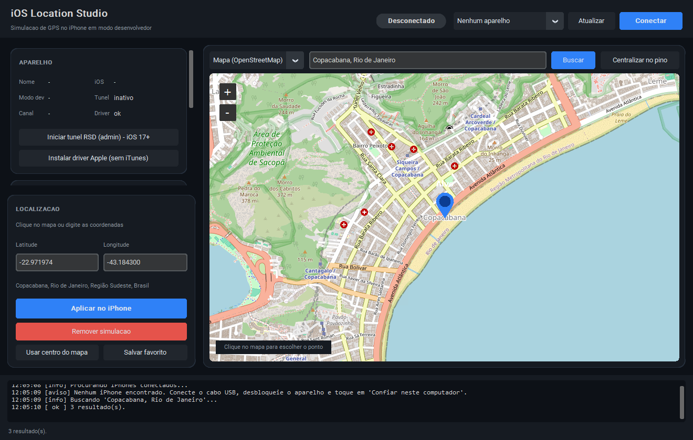

# iOS Location Studio

Aplicativo desktop em Python para **simular a localização GPS de um iPhone** em modo
desenvolvedor, usando o mesmo canal que o Xcode utiliza na opção *Simulate Location*.
Interface moderna em CustomTkinter com mapa interativo OpenStreetMap.



> Use apenas em aparelhos próprios, para desenvolvimento e teste de apps que dependem
> de localização.

## Recursos

- Detecção de iPhones conectados por USB com nome, versão do iOS e estado do Modo Desenvolvedor.
- Mapa interativo: clique para escolher o ponto, alternância entre mapa e satélite.
- Busca por endereço/cidade (Nominatim) ou entrada direta de `latitude, longitude`.
- Aplicar e **remover** a localização simulada com um clique.
- Favoritos salvos em disco para reutilizar locais frequentes.
- Simulação de movimento: pontos de rota pelo botão direito do mapa e deslocamento
  contínuo na velocidade escolhida (útil para testar navegação, geofences e tracking).
- Túnel RSD (necessário no iOS 17+) iniciado pelo próprio app, com reconexão automática.

## Como funciona

O app escolhe o canal conforme a versão do iOS:

| iOS | Serviço usado | Observação |
| --- | --- | --- |
| até 16 | `com.apple.dt.simulatelocation` via lockdown/USB | a localização vale no aparelho até ser removida |
| 17 e superiores (inclui iOS 26) | DVT/Instruments sobre túnel RSD | a simulação vale enquanto o app estiver conectado |

Como o `pymobiledevice3` 11 é assíncrono, toda a sessão com o aparelho vive em uma
thread própria com seu event loop, e a interface conversa com ela por filas. Ao fechar
o programa, a simulação é removida automaticamente.

## Requisitos

| Item | Detalhe |
| --- | --- |
| Python | 3.10 ou superior, com Tkinter (instalador oficial do python.org) |
| Windows | Suporte a dispositivos Apple — **o próprio app instala** (veja abaixo) |
| iPhone | Cabo USB, aparelho desbloqueado e "Confiar neste computador" aceito |
| iPhone | Modo Desenvolvedor ativo em *Ajustes > Privacidade e Segurança > Modo Desenvolvedor* |
| iOS 17+ | Túnel RSD com privilégios de administrador (o app inicia e pede o UAC) |

O driver de rede do túnel (`wintun.dll`) já vem embutido nas dependências.

### Driver da Apple sem instalar o iTunes

No Windows, o caminho até o iPhone sempre passa pelo driver da Apple: é ele que publica
o `usbmux` em `127.0.0.1:27015` e cria a interface de rede usada pelo túnel do iOS 17+.
Não existe alternativa sem driver — as ferramentas comerciais do gênero simplesmente
embutem esse mesmo pacote da Apple.

O cartão **Aparelho** mostra o estado em `Driver` (`ok` ou `ausente`) e o botão
**Instalar driver Apple (sem iTunes)** resolve sozinho: baixa o pacote oficial da Apple,
recorta o cabinet embutido no executável, extrai apenas o `AppleMobileDeviceSupport64.msi`
com o `expand.exe` do Windows e o instala em modo silencioso com um único pedido de UAC.
São ~40 MB instalados em vez dos ~208 MB do iTunes completo, e nada da Apple é
redistribuído junto do projeto — o download acontece na hora.

Se preferir, o app **Apple Devices** da Microsoft Store ou o iTunes também servem: nesses
casos o suporte a dispositivos roda como processo (`AppleMobileDeviceProcess.exe`) em vez
de serviço, e pode ser necessário abrir o iTunes uma vez para ativá-lo.

## Instalação

No Windows, dê duplo clique em `executar.bat`: ele cria o ambiente virtual, instala as
dependências e abre o programa. Manualmente:

```bash
python -m venv .venv
.venv\Scripts\activate        # Windows
# source .venv/bin/activate   # macOS/Linux
python -m pip install -r requirements.txt
python main.py
```

## Como usar

1. Conecte o iPhone por USB, desbloqueie e aceite "Confiar neste computador".
2. Abra o app e clique em **Atualizar** para listar os aparelhos.
3. Clique em **Conectar**. Em iOS 17 ou superior, o app sobe o túnel RSD sozinho:
   aceite o pedido de administrador do Windows e ele reconecta automaticamente.
   Na primeira conexão a imagem de desenvolvedor é baixada e montada (alguns MB).
4. Escolha o destino: clique no mapa, busque um endereço ou digite as coordenadas.
5. Clique em **Aplicar no iPhone**. O selo do topo passa a exibir *Simulando GPS*.
6. Para voltar ao GPS real, clique em **Remover simulação** (fechar o app também remove).

### Simulando movimento

Clique com o botão direito no mapa em **Adicionar ponto de rota** para marcar dois ou
mais pontos, ajuste a velocidade e clique em **Iniciar percurso**. O app envia uma nova
coordenada por segundo, interpolando o caminho entre os pontos.

## Limitações importantes

- **O mapa não lê o GPS real do iPhone.** O protocolo de desenvolvedor da Apple permite
  *escrever* uma localização, não consultá-la. Na primeira abertura o mapa é centralizado
  na localização aproximada do computador (por IP) apenas como ponto de partida; depois
  ele mostra o último ponto usado ou o que está sendo simulado.
- No iOS 17+ a simulação depende da conexão aberta: desconectar o cabo, fechar o
  programa ou parar o túnel devolve o GPS real imediatamente.
- Alguns apps com detecção antifraude podem identificar localização simulada; isso é
  comportamento do app, não do programa.
- O túnel RSD precisa de administrador porque cria uma interface de rede virtual para
  falar com o aparelho.

## Estrutura

```
main.py              ponto de entrada e verificação de dependências
diagnostico.py       checagem rápida de driver, pareamento, imagem e túnel
executar.bat         atalho de instalação + execução no Windows
requirements.txt
app/
  device.py          sessão assíncrona com o iPhone (pymobiledevice3)
  ui.py              interface, mapa e simulação de movimento
  driver.py          instalação do suporte a dispositivos Apple, sem iTunes
  geo.py             geocodificação e cálculos de distância/interpolação
  config.py          preferências e favoritos em JSON
```

As preferências e os favoritos ficam em `%APPDATA%\iOSLocationStudio\config.json`
(Windows) ou no diretório de configuração equivalente do sistema.

## Problemas comuns

Antes de investigar, rode `python diagnostico.py`: ele testa driver, pareamento,
modo desenvolvedor, imagem montada e túnel, com tempo limite em cada etapa.

| Sintoma | Solução |
| --- | --- |
| "O suporte a dispositivos Apple não está ativo" | Clique em **Instalar driver Apple (sem iTunes)** no cartão Aparelho e reconecte o cabo |
| "Nenhum iPhone encontrado" | Troque o cabo/porta, desbloqueie o aparelho e aceite o pareamento |
| "Modo Desenvolvedor desativado" | Ative em Ajustes > Privacidade e Segurança > Modo Desenvolvedor e reinicie o iPhone (o menu só aparece após o primeiro pareamento com uma ferramenta de desenvolvedor) |
| O túnel não sobe | Aceite o UAC, ou rode em terminal como administrador: `python -m pymobiledevice3 remote tunneld` |
| Falha ao montar a imagem | Rode `python -m pymobiledevice3 mounter auto-mount` com o aparelho desbloqueado |
| "O serviço de imagens do iPhone travou" | Uma montagem foi interrompida no meio; reinicie o iPhone, reconecte o cabo e tente de novo |
| Mapa em branco | O mapa precisa de internet para baixar os tiles do OpenStreetMap |
